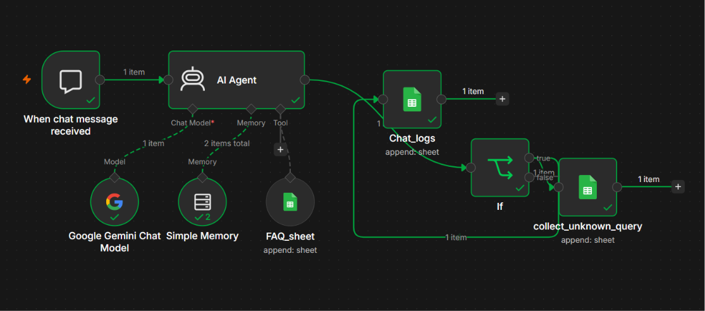
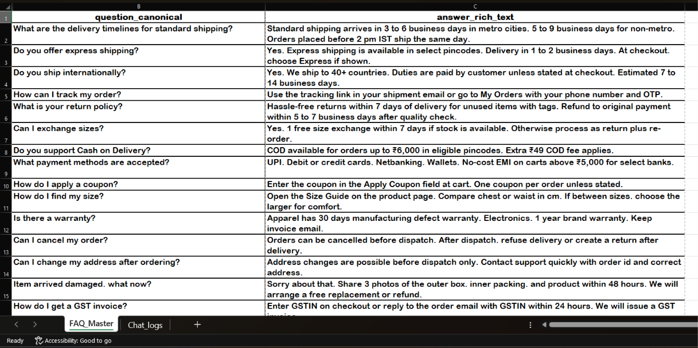
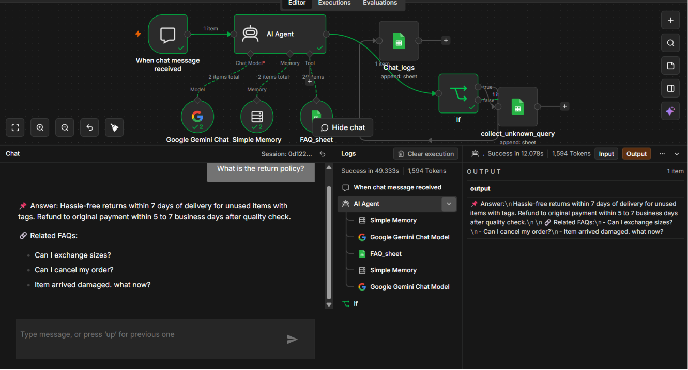

# AI-Powered FAQ Assistant

## Overview

An intelligent FAQ chatbot built using n8n, Google Gemini, and Google Sheets.

## Features

- Answers customer queries using a FAQ knowledge base
- Conversational memory
- Automatic chat logging
- Unknown query tracking
- Workflow automation using n8n

## Tech Stack

- n8n
- Google Gemini
- Google Sheets
- AI Agents
- Prompt Engineering

## What I Learned

- AI Agents
- Workflow Automation
- Prompt Engineering
- API Integration
- Conversational AI

## Project Screenshots

### Workflow Diagram

### FAQ Database

### Chatbot Demo

## Setup

1. Import `workflow.json` into n8n
2. Configure Google Gemini credentials
3. Configure Google Sheets OAuth credentials
4. Create and connect the `FAQ_Master` Google Sheet
5. Execute the workflow and start chatting

## Future Improvements

- PDF Chatbot
- Vector Database Integration
- Multi-language Support
